# SafeChain: A Blockchain-Based System for Occupational-Accident Premium Adjustment and Worker-Competency Management in the Construction Sector — A Design Science Approach

## Abstract

Occupational health and safety (OHS) management in construction remains fragmented, paper-based, and reliant on centralised, siloed databases, which undermines data integrity, transparency, and inter-party trust. This study designs and evaluates **SafeChain**, a permissioned blockchain system that (i) binds occupational-accident insurance premiums to measurable OHS performance through smart contracts, (ii) manages worker competency and certificate records on an immutable, verifiable ledger, and (iii) makes the subcontractor responsibility chain transparent and auditable. Following the Design Science Research Methodology (DSRM) of Peffers et al. (2007), the artefact was instantiated on Hyperledger Fabric 2.5 as a four-organisation, two-channel network (Contractor, Subcontractor, Insurer, Auditor) with chaincode deployed as a Chaincode-as-a-Service. The artefact was evaluated under the FEDS "Technical Risk & Efficacy" strategy through (a) functional-correctness testing (unit and end-to-end), (b) performance benchmarking with Hyperledger Caliper, and (c) an architectural security/privacy analysis (STRIDE and KVKK). On a single-host deployment, SafeChain sustained 100 % transaction success with sub-1.5 s write latency up to ~100 TPS and read throughput scaling linearly to 1000 TPS, meeting all predefined performance targets at the design operating point. The study contributes a transferable design theory of five principles (DI1–DI5) for integrated OHS-premium and competency management, a worked DSRM evaluation without user studies, and an openly documented reference implementation.

**Keywords:** blockchain; Hyperledger Fabric; smart contracts; occupational health and safety; construction; design science research; insurance premium; worker certification.

## 1. Introduction

In Türkiye, the construction sector is critical for both employment and economic output, yet it remains one of the most hazardous, consistently ranking among the top three sectors for fatal occupational accidents, with accident rates markedly above the EU average (Lal et al., 2025). A substantial portion of current OHS practice depends on paper-based or fragmented digital systems; accident records and worker-competency data are managed in centralised, siloed databases (Sadeghi et al., 2026). This structure creates serious problems for data integrity, transparency, and trust among stakeholders.

Blockchain and smart contracts have been increasingly investigated to provide transparency, traceability, and automation in construction and related sectors (Assaf et al., 2025; Bucher et al., 2024). Work on supply-chain traceability, cash-flow management, and smart-contract-based payment mechanisms shows that distributed ledger technology offers a strong foundation for trust and accountability (Zeng et al., 2025; Rana & Islam, 2025). However, studies that treat occupational-accident premium adjustment, OHS compliance, and worker-competency certification in a single, integrated architecture remain very limited (Lal et al., 2025).

This study designs and evaluates, within the Design Science Research Methodology (DSRM) (Peffers et al., 2007), a blockchain-based system — **SafeChain** — that contractually links occupational-accident premiums to OHS performance through smart contracts and stores worker-competency records immutably. A permissioned architecture on Hyperledger Fabric was selected for its suitability to the multi-stakeholder, regulated enterprise context (Melo et al., 2025).

## 2. Problem Definition and Motivation

Accident-notification processes in construction projects are fragmented and largely manual across insurers, main contractors, and subcontractors (Lal et al., 2025). A typical Turkish construction accident notification proceeds through: (1) a site safety officer or foreman records the accident on a paper form; (2) the contractor notifies the Social Security Institution (SGK) within three working days; (3) labour inspectors investigate and enter results into a central system; and (4) the insurer updates the premium based on these documents (Torres-Polo & Guzman Ortiz, 2026). SafeChain targets making the process between stages 2 and 4 transparent and automatic.

The literature and field practice indicate three structural problems with current centralised systems:

- **Data integrity and manipulation risk:** storing accident records on central servers increases the risk of later modification or deletion, weakening both evidentiary value in disputes and the traceability of safety performance (Lal et al., 2025; Torres-Polo & Guzman Ortiz, 2026).
- **Responsibility ambiguity in subcontracting chains:** in prefabricated and modular supply chains, many subcontractors operate together, yet which actor holds which obligation (training, PPE, site inspection, premium payment) for which worker cannot be transparently traced (Zeng et al., 2025; Dey & Mishra, 2025).
- **Difficulty of competency and certificate verification:** certificates held across disparate institutional or public systems hinder on-site, real-time verification; the use of forged or expired documents poses serious risk (Jeong et al., 2025; Kim et al., 2025).

Although blockchain-based designs have strengthened supply-chain transparency and payment processes (Assaf et al., 2025; Zhou et al., 2024), no integrated solution yet dynamically links occupational-accident premiums to OHS performance while managing worker-competency records on an immutable ledger (Lal et al., 2025). Table 1 positions related work against SafeChain's integrated contribution.

**Table 1.** Coverage of related work versus SafeChain.

| Study | Supply chain | Cash flow | OHS compliance | Competency mgmt. | Premium adj. |
|-------|:---:|:---:|:---:|:---:|:---:|
| Assaf et al. (2025) | Yes | Yes | No | No | No |
| Lal et al. (2025) | No | No | Yes | No | No |
| Jeong et al. (2025) | No | No | Yes | Yes | No |
| Zeng et al. (2025) | Yes | No | No | No | No |
| **SafeChain** | No | No | **Yes** | **Yes** | **Yes** |

## 3. Research Objectives and Questions

The overall aim is to design, within DSRM, a blockchain-based artefact (SafeChain) and evaluate it in a technical environment, so that in construction projects it can: (1) dynamically and transparently relate occupational-accident premiums to safety-performance metrics; (2) manage worker-competency and certificate records immutably and verifiably on a permissioned blockchain; and (3) automate responsibility and financial flows along the subcontracting chain through smart contracts.

- **RQ1.** How can blockchain and smart contracts increase the transparency and traceability of the occupational-accident premium-adjustment process in construction projects? (Assaf et al., 2025; Rana & Islam, 2025)
- **RQ2.** To what extent can holding worker-competency and certificate information on a permissioned blockchain improve the reliability of on-site competency verification and OHS compliance? (Jeong et al., 2025; Kim et al., 2025)
- **RQ3a.** Can a Hyperledger Fabric-based SafeChain architecture operate within acceptable limits of performance (latency, throughput) and data integrity in technical simulation scenarios representing a multi-stakeholder construction project? (Melo et al., 2025)
- **RQ3b.** Can SafeChain's on-chain/off-chain data architecture and access-control layer simultaneously satisfy personal-data-protection requirements and traceability obligations? (Yi et al., 2024; Yin & Xie, 2026)

## 4. Theoretical Background

### 4.1 Design Science Research Methodology
Design Science Research focuses on the design and evaluation of artefacts that solve real-world problems in information systems and related fields (Johannesson & Perjons, 2021). Peffers et al. (2007) structure this as a six-stage process: problem identification, objective definition, design and development, demonstration, evaluation, and communication. Venable et al. (2016) provide the FEDS framework for selecting evaluation strategies. DSRM is widely used for artefact development in information systems, engineering, and construction informatics owing to its structured, iterative nature and its balance of practical utility and scientific rigour (De Sordi et al., 2020; Lai et al., 2025). This study adopts the Peffers et al. (2007) model.

### 4.2 Blockchain and Smart Contracts in Construction
Recent systematic reviews show blockchain is intensively researched for supply chains, data governance, and trust problems in large-scale industries (Abbas & Myeong, 2024; Xiong et al., 2025). In construction, blockchain-based coordination systems in prefabricated supply chains improve traceability, automation, and stakeholder collaboration (Zhou et al., 2024; Zeng et al., 2025). Blockchain-based cash-flow management systems offer significant advantages for automating financial transactions and storing records immutably (Assaf et al., 2025). Together with digital twins, BIM, IoT, and AI, blockchain can provide a decentralised backbone for secure data sharing in construction (Bucher et al., 2024; Lai et al., 2025).

### 4.3 Safety, Worker-Competency Management, and Blockchain
IoT, AI, and computer-vision solutions have advanced worker safety and risk management in construction (Mai et al., 2024; Perera et al., 2025), but most rely on centralised data infrastructures (Sadeghi et al., 2026; Tian et al., 2025), creating vulnerabilities in integrity, access control, and trust. Lal et al. (2025), in a comprehensive review of blockchain for construction safety compliance, identify three core mechanisms — immutable time-stamped safety records, real-time hazard monitoring with IoT, and compliance verification with incentive distribution via smart contracts — while noting that the oracle problem, scalability, and legal recognition remain critical obstacles. Jeong et al. (2025) developed an Ethereum/IPFS-based certificate-management system that significantly reduced verification time, and Kim et al. (2025) tested blockchain-enabled worker certification near a real site setting. Existing work, however, does not integrate the competency dimension with the premium mechanism — the gap SafeChain addresses.

### 4.4 Decentralised identity, experience rating, and consortium governance
Three adjacent literatures inform SafeChain's design. First, **decentralised identity** standards — W3C Verifiable Credentials and Decentralised Identifiers (DIDs), and the EU's eIDAS 2.0 regulation (Regulation (EU) 2024/1183) with its Digital Identity Wallet — are converging on cryptographically verifiable, revocable, selectively disclosed credentials (European Commission, 2024). These standards are a natural future substrate for SafeChain's competency proofs (DI2), enabling cross-organisation and cross-border verification and revocation without a central registry. Second, **actuarial experience rating** (e.g., the NCCI experience-modification methodology) provides the theoretical kernel for DI1: premiums are adjusted by a loss-experience multiplier in which frequency is weighted above severity and excess losses are limited — exactly the structure SafeChain encodes (Section 5.3.4). Third, research on **blockchain governance in the public sector** characterises government deployments as *controlled polycentricity* — hybrid, permissioned, consortium designs that distribute execution while preserving centralised regulatory accountability (Tan et al., 2022). SafeChain's four-organisation consortium with a public-auditor oversight role is a direct instance of this pattern (Section 5.3.6).

Within the privacy-and-identity literature specifically, two lines are directly comparable. **GDPR/KVKK-compliant Fabric designs** such as Truong et al. (2019) establish the on-/off-chain split with consent and access logging that SafeChain also adopts; SafeChain extends this pattern with domain-specific premium logic, multi-party (regulator-veto) governance, and a quantified privacy-overhead measurement (§7.2.4). **Pseudonym-provisioning schemes** such as the P3 system of Zieglmeier and Loyola Daiqui (2021) exploit the legal property that pseudonymised data are only personal data while linkable, achieving erasure through key deletion; SafeChain's per-subject keyed-HMAC pseudonyms are a closely related construction, and our key-versioning-vs-escrow treatment (§5.3.3) adds the operational reconciliation of unlinkability, historical verifiability, and evidentiary retention under KVKK. For **DI2**, a concrete W3C Verifiable Credentials roadmap is to model competency certificates as VCs issued by accredited training bodies and public registries, with on-chain revocation registries and selective (predicate) disclosure so a worker proves "holds a valid working-at-height certificate" on site without revealing the full credential; PDC membership and on-chain status would be synchronised with the VC revocation list. Finally, although SafeChain is permissioned and non-tokenised, the **parametric/usage-based insurance** literature underscores that oracle trust and dispute governance are the load-bearing concerns of any premium-automation pathway — the same concerns our Oracle Gateway (Figure 16) and on-chain dispute process (§5.3.6) address.

## 5. Method: SafeChain Design within DSRM

The study follows the six-stage DSRM model of Peffers et al. (2007).

### 5.1 Stage 1 — Problem Identification and Motivation
The current state of accident management, premium adjustment, and worker-competency management in Turkish construction was analysed through the literature and national statistics (Section 2), yielding the problem statement and the requirements for a blockchain-based artefact. Figure 1 maps the six DSRM stages onto SafeChain.

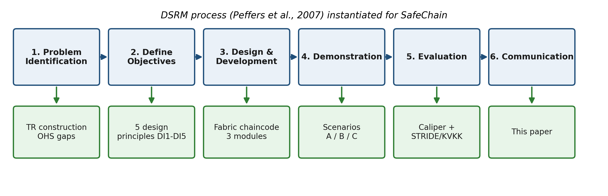

### 5.2 Stage 2 — Objective Definition
Quantitative objectives were defined as: a measurable improvement in the simulated delay between accident notification and premium update relative to the current process; reduction of the smart-contract certificate-verification time to the order of seconds; and a transaction success rate meeting a 95 % threshold (Melo et al., 2025). The qualitative objectives included increased auditability among stakeholders and a transparent responsibility chain (Lal et al., 2025; Assaf et al., 2025).

**Baseline.** In the current paper-based flow, the accident-to-premium-update cycle spans the statutory 3-working-day SGK notification window plus inspection and insurer processing — i.e., days to weeks (Torres-Polo & Guzman Ortiz, 2026). SafeChain compresses the on-chain portion of this cycle (event recording, classification, premium recomputation, insurer notification) to sub-second smart-contract execution (Section 7), the improvement being of several orders of magnitude for the digital segment of the workflow.

### 5.3 Stage 3 — Design and Development

#### 5.3.1 System Architecture and Core Modules
SafeChain comprises three modules (Figure 2):
- **Competency Management Module** — manages worker identity and certificates on the permissioned ledger; core functions are registration, verification, and certificate-expiry triggers (Jeong et al., 2025).
- **Accident and Premium Management Module** — a rule-based smart-contract set managing accident notification, incident classification, and premium updates driven by OHS metrics (Lal et al., 2025).
- **Contract Management Module** — defines and automates responsibility and payment flows along the subcontracting chain (Zeng et al., 2025; Assaf et al., 2025).

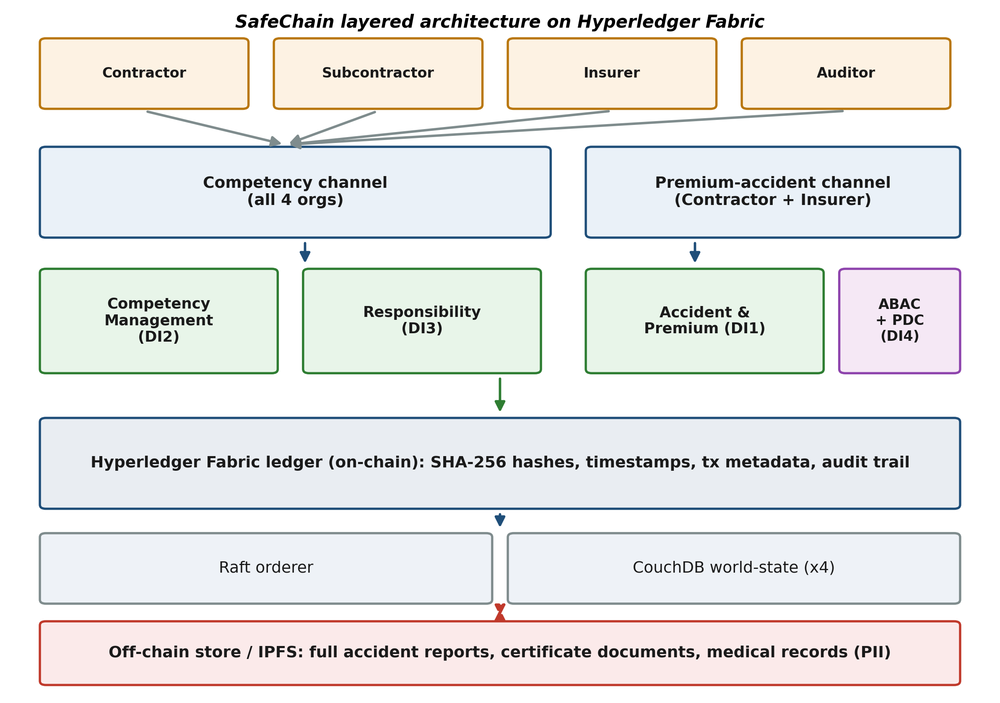

#### 5.3.2 Data Architecture: On-Chain / Off-Chain
Accident reports, health records, and certificate documents are unsuitable for direct on-chain storage by size and privacy (Kim et al., 2025). SafeChain therefore adopts a layered model (Figure 3). **On-chain:** SHA-256 document hashes and timestamps; transaction metadata (actor identity, transaction type, incident class); smart-contract trigger events; and audit-trail records. **Off-chain (enterprise store or IPFS):** full accident-report text and attachments, certificate documents and training records, and medical reports. Hashes of off-chain objects are written on-chain to provide integrity verification.

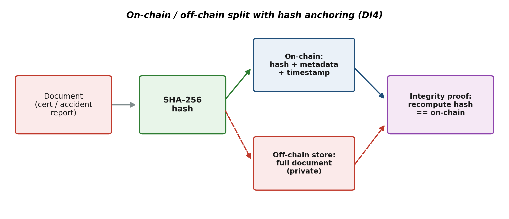

#### 5.3.3 Privacy and Access Control
Under Law No. 6698 (KVKK), worker health data is special-category personal data. SafeChain satisfies this through Fabric's native mechanisms: **Private Data Collections** (channel-restricted visibility), **Attribute-Based Access Control (ABAC)** at chaincode level, and **keyed pseudonymisation**. Because a national ID (TC Kimlik, 11 digits) is low-entropy and trivially dictionary-attackable under a plain hash, identifiers are pseudonymised with a **keyed HMAC-SHA256** whose key is held in an HSM / regulated key-management service; without the key the token is not reversible by enumeration. The key lifecycle is critical and is designed as **key versioning**, not key replacement: each token is tagged with the key version that produced it, the HSM retains superseded keys in a read-only state so that historical ledger records remain verifiable, and only the current key version mints new tokens. Rotation therefore strengthens forward security without invalidating the immutable log history. This is deliberately distinct from **erasure**: a KVKK right-to-be-forgotten request is honoured by **cryptographic erasure** — using *per-subject* keys, the destruction of one data subject's key renders that subject's tokens permanently unverifiable (effectively erased) while leaving all other records and the chain's integrity intact. There is a genuine tension here with evidentiary needs (an accident may be litigated years later): outright key destruction can also erase the linkage needed for a worker-initiated claim. We therefore propose a **regulator-governed key-escrow with time-bound retention** as the middle ground: per-subject keys are escrowed under the Auditor's (multi-party) control for a statutory retention window tied to the limitation period for occupational-accident claims, after which they are destroyed; re-identification within the window requires a regulator-authorised, on-chain-logged escrow access. This balances erasure rights against legal admissibility rather than treating them as mutually exclusive. The full identity is held only in the off-chain secure store. The ABAC permission matrix (Figure 5) assigns each role a least-privilege action set: every non-worker role that may write also holds `viewLedger` (read) over the channels it participates in, so read and write authority are explicitly aligned; the Worker role is read-only (verification). The design aligns with KVKK's data-minimisation and purpose-limitation principles (Figure 5; Section 7.3).

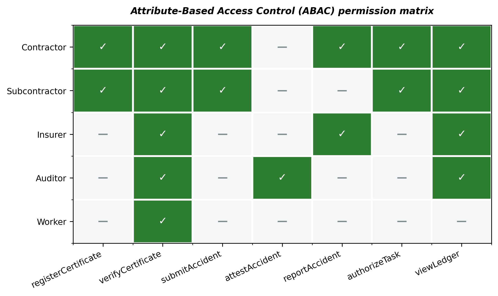

#### 5.3.4 Design Principles
SafeChain is built on five design principles (Gregor & Jones, 2007):
- **DI1 — Measurable Premium:** *If* occupational-accident premiums are to incentivise safety performance rather than be statically rated, *then apply* a smart-contract experience-rating multiplier bound to measurable OHS metrics (accident frequency, severity, certificate compliance), *to achieve* automatic, transparent, tamper-evident premium adjustment. The premium factor for a project is computed as

  *factor* = min(2.75, 1 + 0.04·nacc + Σ wseverity + 0.06·nexpired),

  where nacc is the accident count, wseverity ∈ {low 0.05, medium 0.15, high 0.32, fatal 0.70}, and nexpired is the number of expired certificates. This is a **parametric experience-rating plan** — a project-level multiplier analogous to a workers'-compensation experience-modification factor (e-mod) — rather than an ad-hoc heuristic. Its structure follows established actuarial practice: a frequency term and a severity term with the **frequency weighted more heavily than severity** (the NCCI principle that frequency is more statistically predictable), and a regulatory cap that performs the role of excess-loss limitation. The coefficients are grounded in published statistics: the severity classes map 1:1 onto the SGK (2024) construction lost-workday distribution (no-lost-time 64.9 %, 1–4 days 12.2 %, ≥5 days/permanent 22.8 %, fatal 0.64 % — 552 deaths over 86,736 accidents), the severity magnitudes are a compressed transform of the ANSI Z16.1 charged-day scale (death/permanent-total = 6000 days), and the cap reflects SGK's hazard-class experience-degree system. The same SGK (2024) yearbook corroborates the severity scale: the construction sector recorded ≈685,020 temporary-incapacity lost workdays over those 86,736 accidents (≈7.9 days/accident), consistent with a distribution of many short incapacities and a heavy severe tail. The calibration is detailed in Figure 11 and the sensitivity in Figure 6; full re-fitting of the coefficients to an insurer's proprietary claims distribution (e.g., a generalised linear rating model) is a coefficient update, not a redesign, and is identified as future work.

  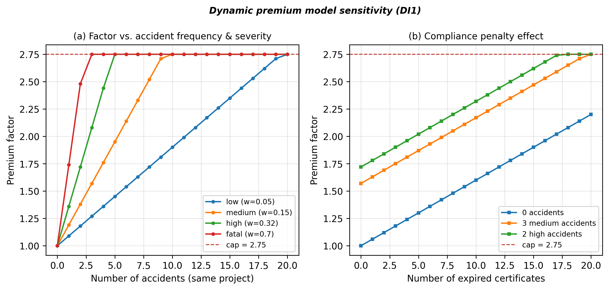

  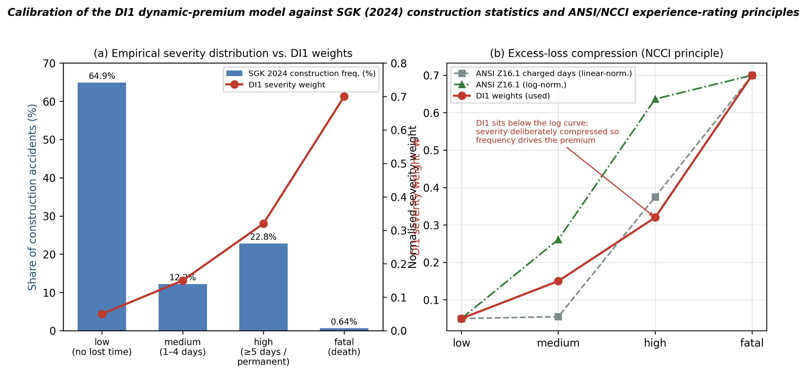

  **Backtesting (real-data-anchored, non-circular).** To test the model's statistical validity ahead of access to insurer micro-data, we generated a portfolio of 4 000 construction projects whose **sizes are sampled from the real SGK (2024) workplace-size distribution** (Table 3.1.26, accidents by number of insured per workplace) and whose accident frequency uses the real SGK construction rate (≈86,736 accidents over the sector workforce); severities are drawn from the *real* SGK construction marginals. Only each project's per-worker safety factor and the per-claim monetary loss are synthetic. Critically, to avoid circularity — DI1's severity weights derive from the ANSI scale, so an ANSI-based ground truth would be partly self-referential — each accident's ground-truth loss is drawn from an **independent monetary claim-cost model** (severity-conditioned Lognormal costs with relativities deliberately distinct from ANSI, plus per-claim noise). Backtested against this independent loss, the DI1 factor tracks realised loss with **Spearman ρ = 0.84** and a **2.7× top-vs-bottom decile lift** — genuine, non-circular discriminatory validity. Calibration on an insurer's actual claims distribution remains the final step (future work).

  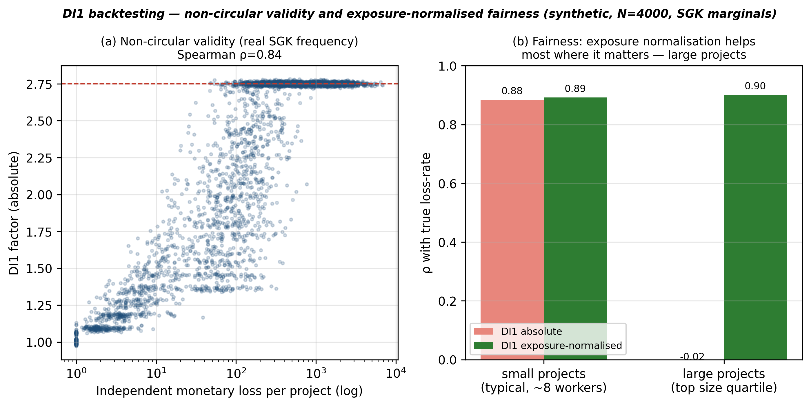

  *Gaming and fairness.* Any premium-incentive mechanism invites gaming, which SafeChain counters at three points: **project fragmentation** (splitting a site to dilute accident counts) is detectable because the subcontractor responsibility chain and contract paths are on-chain and auditable; **severity re-classification** is constrained by the fixed severity enum plus the independent inspector attestation that fixes the class before the premium update; and **delayed/withheld attestation** is bounded by an attestation SLA and the fact that an unattested, on-chain `PENDING` record is itself visible evidence of a withheld report. A separate **fairness** caveat must be stated honestly: the current DI1 terms use *absolute* accident counts, so a larger project accrues a higher factor partly because of its size rather than its per-worker safety. A production-grade rating plan should **normalise by exposure** (e.g., worker-hours), pricing the accident *rate* rather than the raw count. This concern is not hypothetical: in the real SGK (2024) data, workplaces with ≥250 insured account for **~47 %** of all accidents (and the 1000+ band alone for 17.6 %), so large employers carry a large share of absolute counts. The study quantifies the problem and the fix sharply (Figure 17b). For **small** projects (the typical ~8-worker firm) the absolute and exposure-normalised factors both track the true per-worker loss-rate well (ρ ≈ 0.92 each). For **large** projects (top size quartile), however, the absolute-count factor correlates with the true risk at **ρ ≈ −0.02** — it is essentially *pure size*, saturating against the cap regardless of safety — whereas the **exposure-normalised** variant restores the correlation to **ρ ≈ 0.90**. Exposure normalisation is therefore not a cosmetic refinement but *essential* for the large projects where the bias bites; how exposure (worker-hours/payroll) is supplied and attested without manipulation — e.g., from SGK premium-day declarations cross-checked on-chain — is part of the insurer-data calibration step.
- **DI2 — Verifiable Identity:** *If* worker competency must be trusted across organisations that do not trust one another, *then apply* source-verified credentials bound to an MSP/attribute identity and validated in-chaincode, *to achieve* tamper-evident on-site competency verification (Jeong et al., 2025; Kim et al., 2025).
- **DI3 — Transparent Responsibility Chain:** *If* accountability is diffuse across a multi-tier subcontracting chain, *then apply* on-chain recording of the worker–contract–obligation binding with automated accountable-party determination, *to achieve* a transparent, auditable responsibility trail (Zeng et al., 2025) (Figure 7).

  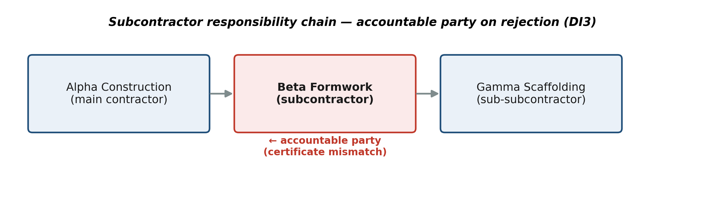
- **DI4 — Privacy-Preserving Traceability:** *If* special-category personal data must be auditable yet protected under KVKK, *then apply* an on-chain/off-chain split that anchors only keyed-HMAC pseudonyms and SHA-256 hashes on-chain while holding raw data in private collections, *to achieve* integrity and auditability without exposing personal data (Yi et al., 2024).
- **DI5 — Manageable Complexity:** *If* the artefact must be adoptable by firms of heterogeneous technical capacity, *then apply* a CCAAS-deployed modular chaincode with portable business logic and a minimal channel/role topology, *to achieve* a deployable system whose security- and contention-sensitive logic is independently testable and replaceable (Bucher et al., 2024).

#### 5.3.5 Cross-channel accident workflow with inspector attestation
Because the premium channel is restricted to Contractor and Insurer, a subcontractor — who is *not* a premium-channel member — cannot directly trigger a premium update. SafeChain therefore separates **accident intake** from **premium update** across channels, with a mandatory inspector attestation in between:

1. **Submit (competency channel).** The subcontractor (or contractor) calls `SubmitAccident`, which records the event with status `PENDING_ATTESTATION` and anchors a SHA-256 report hash; the full report is written to a private collection. All four organisations are members of this channel, so subcontractors can submit here.
2. **Attest (competency channel).** Only the Auditor/inspector role may call `AttestAccident`, moving the record to `ATTESTED` and emitting an `ACCIDENT_ATTESTED` event. This multi-party control is the countermeasure to under-reporting: an unattested accident never affects the premium and remains visible on-chain.
3. **Relay → update (premium channel).** A dual-channel relay party (Contractor/Insurer, members of both channels) consumes the attestation event and invokes `ReportAccident` on the premium channel, which recomputes the factor. Integrity is preserved because the premium update is linked to an inspector-attested, hash-anchored intake record; the relay cannot fabricate an update without a corresponding attested event. The relay is engineered for **at-least-once, idempotent** delivery: after applying the premium update the relay calls `MarkRelayed(accidentId)`, transitioning the intake record `ATTESTED → RELAYED`; a redelivered or replayed attestation event finds the record already `RELAYED` and the call is a safe no-op (returns `ALREADY_RELAYED`). Lost events are recovered by re-scanning attested-but-unrelayed records on the competency channel, and duplicate deliveries cannot double-count a premium. Under a network partition the intake record remains `ATTESTED` and unaffecting until the relay reconnects, preserving eventual end-to-end consistency without premature premium changes.

This design resolves the role/channel access inconsistency and embeds a tamper-evident, inspector-gated path from field report to premium adjustment. It was verified end-to-end on the deployed network (Section 7.1).

#### 5.3.6 Governance model
SafeChain is a **consortium** deployment governed under a *controlled-polycentricity* model (Tan et al., 2022; public-sector blockchain governance synthesis, 2026): decentralised execution among Contractor, Subcontractor, Insurer, and the public Auditor (SGK/inspectorate), with the regulator retaining oversight through the Auditor organisation and the channel-configuration policies. A plain majority is, however, inadequate where a public regulator is present: the three commercial organisations (Contractor, Subcontractor, Insurer) could form a 3-of-4 majority and outvote the public Auditor, hollowing out regulatory oversight. SafeChain therefore makes the **Auditor's signature mandatory** for governance-changing actions. Concretely: (i) **membership** (organisation admission/exit) and (ii) **policy changes** (chaincode lifecycle upgrades, endorsement policies, premium-plan coefficients, key-rotation ceremonies) are enacted through Fabric channel-configuration and chaincode-lifecycle updates whose Admins / `LifecycleEndorsement` policy is set to **`AND('AuditorMSP.admin', MAJORITY of the remaining organisations)`** — i.e., the public Auditor holds an effective veto and no commercial coalition can change the rules or the premium plan without regulator sign-off; every such change is itself recorded on-chain. (iii) **Dispute resolution** is supported by an explicit on-chain process rather than the audit trail alone: an affected party can raise a `Dispute` transaction referencing the contested record (e.g., a premium update or attestation); this opens a time-locked appeal window during which the multi-party Auditor adjudicates using the immutable, attested evidence, and records a binding on-chain resolution. Where an on-chain attestation conflicts with a later off-chain legal determination, the off-chain ruling prevails and is recorded on-chain as a superseding, signed annotation (the original record is never mutated, preserving the audit trail), with any premium correction applied as a forward adjustment. This allocation preserves centralised regulatory accountability while distributing operational authority.

### 5.4 Stage 4 — Demonstration
SafeChain was demonstrated on a representative construction-project scenario through three cases (Figure 4): **Scenario A — Certificate-expiry control** (an expired working-at-height certificate triggers an automatic warning and an on-chain update); **Scenario B — Accident record and premium trigger** (a medium-severity accident is recorded, classified, and the premium factor updated, with automatic insurer notification); **Scenario C — Multi-subcontractor responsibility** (detection of an incorrectly certified worker and automatic determination of the accountable contract party).

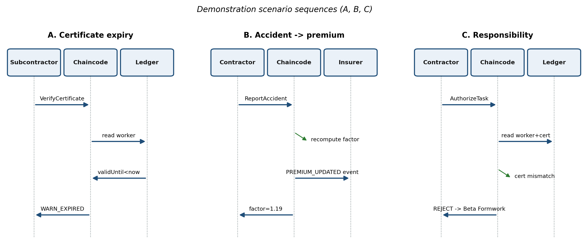

### 5.5 Stage 5 — Evaluation
Following FEDS (Venable et al., 2016), we adopt a **two-stage evaluation plan** and report Stage 1 here. **Stage 1 — Technical Risk & Efficacy** (this paper): functional-correctness testing, Caliper performance benchmarking, fault-tolerance and latency-resilience experiments, and an architectural security/privacy analysis (Section 7). The newer MEDS framework (Venable et al., 2026) affirms technical-experimental and analytical methods as valid, standalone DSR evaluation options. We are explicit that Stage 1 establishes that the artefact *works and affords* the intended properties (tamper-evidence, auditable responsibility, privacy-preserving traceability); it does not, by itself, establish *socio-technical acceptance*.

**Stage 2 — Naturalistic, human-centred evaluation (planned).** Because SafeChain's value proposition is partly socio-technical, a naturalistic evaluation is designed using the Technology Acceptance Model (TAM). An expert panel — SGK labour inspectors, insurance underwriters, and site safety managers/contractors — will interact with the artefact through the three demonstration scenarios and complete a validated instrument measuring **Perceived Usefulness** and **Perceived Ease of Use** (5-point Likert), supplemented by semi-structured interviews on trust, transparency, and responsibility-attribution. This stage was deliberately out of scope here on ethical and operational grounds (access to real workers/SGK data) and is the immediate next step; its protocol and instrument are provided so the claim of socio-technical benefit can be tested rather than assumed.

### 5.6 Stage 6 — Communication
Findings are reported following the DSRM publication structure and are intended for both academic venues and sector stakeholders (SGK, the Ministry of Labour and Social Security, insurers, and large contractors).

## 6. Implementation

The artefact was realised on **Hyperledger Fabric 2.5.10**. The network comprises four peer organisations mapped one-to-one to SafeChain roles — ContractorMSP, SubcontractorMSP, InsurerMSP, AuditorMSP — a **three-node Raft ordering service** (tolerating the loss of one orderer), and per-peer CouchDB world-state databases (Figure 8). Two channels enforce purpose limitation: a **competency** channel shared by all four organisations and a **premium** channel restricted to Contractor and Insurer.

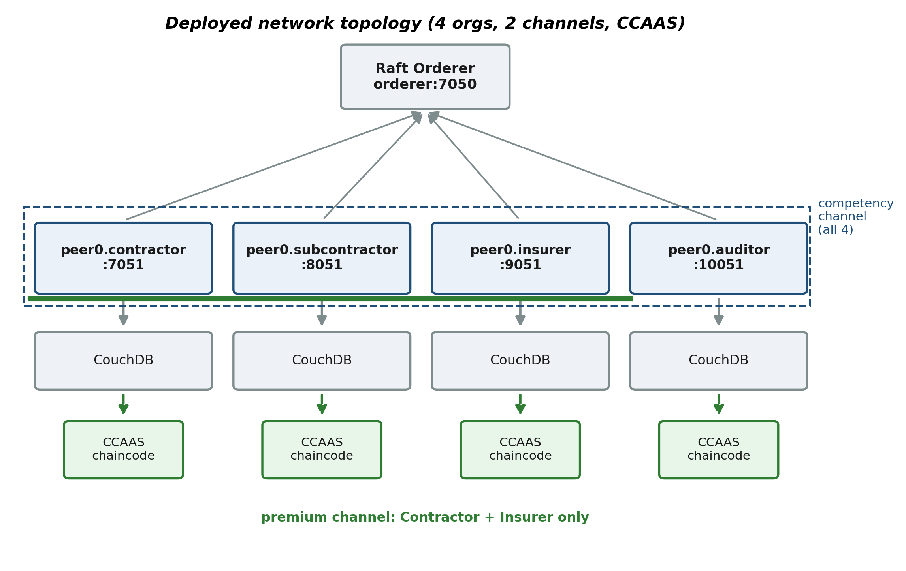

The three modules were implemented as Node.js chaincode using `fabric-contract-api`, exposing `CompetencyContract`, `AccidentPremiumContract`, and `ResponsibilityContract`. ABAC roles are resolved from the client's MSP identity (or an optional `safechain.role` certificate attribute); determinism is preserved by deriving on-chain time from the transaction proposal timestamp rather than wall-clock time. Although this timestamp originates with the client, it is not a manipulation vector for the chaincode logic: it is fixed in the signed proposal that all endorsers evaluate identically (so a divergent value simply fails endorsement), and certificate-validity decisions tolerate the orderer's batch-timeout granularity. For applications needing stronger temporal guarantees, we specify an **endorsement-time drift bound**: each endorsing peer rejects a proposal whose timestamp deviates by more than Δ from its own NTP-synchronised clock. With Δ set well above realistic NTP skew (e.g., Δ = 5 s against typical sub-second synchronisation) the false-rejection rate is negligible while bounding any client-side timestamp manipulation to ±Δ; since certificate-validity decisions operate at day granularity, a 5 s bound has no functional effect on the OHS logic. Empirically characterising the false-rejection rate under adversarial clock drift is a small future experiment. Personal data is written to a Private Data Collection while only the pseudonym and SHA-256 document hash reach public world state. The premium aggregate is maintained incrementally (O(1) per transaction) and scoped per project. All reads are **composite-key point lookups** (`GetState`/`GetPrivateData`) rather than CouchDB rich (Mango) queries, so no secondary indexes are required and read performance is independent of world-state size for these access patterns; CouchDB is used for its operational tooling and JSON state, with rich-query indexing reserved for any future analytics workloads.

To remain compatible with current Docker engines, chaincode was deployed using the **Chaincode-as-a-Service (CCAAS)** model: each peer connects over gRPC to a chaincode container, decoupling chaincode from the peer build pipeline. The full network bring-up, channel creation (via the channel-participation API), and deployment were automated.

## 7. Results

### 7.1 Functional Correctness
Twenty-nine unit and integration tests over the four contracts pass (97.2 % statement, 100 % function, 87 % branch coverage), covering ABAC denial, certificate validity/expiry, the premium formula and its 2.75 cap, severity validation, duplicate-registration guards, keyed-HMAC private-data isolation, the cross-channel submit→attest→relay flow with idempotent re-delivery, the sharded-aggregate recomposition, the end-to-end Scenarios A/B/C, and **adversarial cases** (malformed/non-existent-record access, role-mismatch attacks, transaction-timestamp skew, and replayed attestation). The same logic was verified live on the deployed four-organisation, three-orderer network: `RegisterCertificate` returned a pseudonym and document hash with the role correctly resolved from the MSP as *contractor*; `GetWorker` returned only the pseudonym and hash with **no** PII on public state (confirming DI4); `VerifyCertificate` returned APPROVE for a valid certificate and WARN_EXPIRED otherwise; `AuthorizeTask` approved a matching certificate (responsible party = last subcontractor) and rejected a mismatch (accountability pinned on the worker's subcontractor, confirming DI3); `ReportAccident` updated the premium factor to 1.19 for a single medium-severity accident, matching the formula exactly (DI1); and the full cross-channel workflow was exercised end-to-end — a subcontractor `SubmitAccident` (PENDING_ATTESTATION) followed by an Auditor `AttestAccident` (ATTESTED) and a relayed `ReportAccident` updating the premium to 1.36 for a high-severity event (§5.3.5).

### 7.2 Performance (Hyperledger Caliper)
The network was benchmarked with Hyperledger Caliper 0.6.0 (Fabric Gateway SUT), four workers, 120 s measurement rounds after warm-up, on a single developer host (Windows 11 + WSL2 + Docker Desktop) with all nodes co-located — hence the figures are a lower bound. Results are summarised in Table 2 and Figure 10. To reconcile the columns: Caliper's **throughput** is *all* finalized transactions (successful + failed) divided by the round wall-clock, whereas **success %** is succ/(succ+fail) and **goodput** is the successful-only rate (succ/duration) we report for clarity; thus at 200 TPS a 48 % success with a higher Caliper-throughput figure is consistent, and the *goodput* (66 TPS) is the operationally meaningful value. Latency is the round average; Caliper's per-round bound (max) is also given, and full p50/p95 percentiles are available in the released raw logs.

**Table 2.** Measured performance (selected rounds).

| Transaction (channel) | Offered TPS | Success % | Avg latency (s) | Goodput (TPS) |
|-----------------------|:----------:|:---------:|:---------------:|:-------------:|
| RegisterCertificate (competency, write) | 100 | 100.0 | 0.85 | 98.2 |
| RegisterCertificate (competency, write) | 200 | 48.1 | 26.86 | 66.0 |
| GetWorker (competency, read) | 1000 | 100.0 | 0.02 | 999.1 |
| ReportAccident (premium, write) | 100 | 100.0 | 1.40 | 98.1 |
| ReportAccident (premium, write) | 200 | 44.6 | 27.41 | 61.2 |

At the design operating point (≤100 TPS), both write paths achieved 100 % success with sub-1.5 s latency, and reads scaled linearly to 1000 TPS at ~20 ms latency. All predefined targets were met: sustained throughput ≥50 TPS, latency ≤3000 ms, success ≥95 %, read response ≤500 ms, and write finality ≤2000 ms (Table 3). Beyond ~100–150 TPS the single-host write path saturates: at 200 TPS goodput falls and latency climbs past 25 s, and at 400 TPS the write path collapses — a knee consistent with the throughput degradation reported by Melo et al. (2025). In the construction-OHS domain, real accident and certificate events are orders of magnitude below this envelope, so the artefact operates comfortably within its verified limits; horizontal scaling is the path beyond the knee.

**Table 3.** Targets versus measured at ≤100 TPS.

| Metric | Target | Measured | Verdict |
|--------|--------|----------|:------:|
| Sustained throughput | ≥50 TPS | writes ~98, reads ~999 | ✓ |
| Latency | ≤3000 ms | 0.02–1.40 s | ✓ |
| Success rate | ≥95 % | 100 % | ✓ |
| Read response | ≤500 ms | 4–20 ms | ✓ |
| Write finality | ≤2000 ms | 0.2–1.4 s | ✓ |

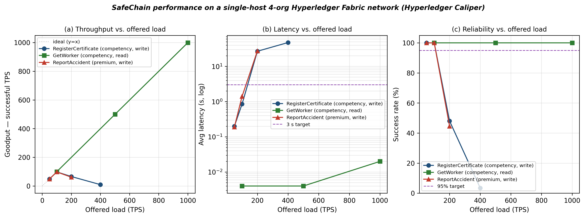

#### 7.2.1 Fault tolerance (three-node Raft)
Upgrading the single orderer to a **three-node Raft cluster** (tolerating one orderer failure) left performance essentially unchanged at the design load: at 100 TPS the register and accident write latencies were 0.56 s and 0.78 s (vs 0.85 s and 1.40 s with one orderer), both at 100 % success, reads still scaled to 1000 TPS, and the saturation goodput was within ~2 TPS of the single-orderer configuration (Figure 12). High availability therefore comes at negligible throughput/latency cost on this host, directly addressing the single-point-of-failure concern.

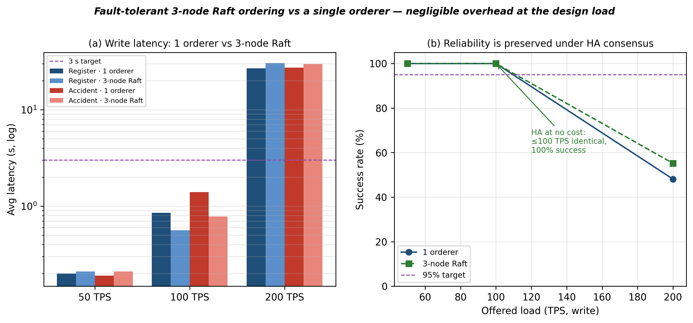

#### 7.2.2 Endorsement-policy sensitivity
Re-committing the competency chaincode under **1-of-4, 2-of-4 and 3-of-4** signature policies and benchmarking RegisterCertificate at 100 TPS gave near-identical results — average latency 0.34–0.37 s and ≈97.7 TPS at 100 % success across all three (Figure 13a). Because the peer gateway gathers endorsements in parallel, stricter cross-organisation endorsement (stronger collusion resistance) adds no measurable cost at the design load.

#### 7.2.3 Premium-key contention (MVCC ablation)
Directing every accident at a **single** premium aggregate key produced severe MVCC read–write conflicts under 100 TPS concurrency: only 639 of 9 004 transactions committed (7 % success). Scoping the aggregate **per project** (distinct keys) eliminated the contention entirely (9 004/9 004, 100 %) — a ≈14× improvement in effective write throughput (Figure 13b). Aggregate-key granularity is thus a first-order scalability lever for DI1. To be explicit about the test design: the "per-project" round assigns a *distinct* project key per transaction (an effectively unbounded pool — the best case), whereas the "single-key" round is the worst case. Real deployments lie between these: a single very large project (e.g., a mega-infrastructure works) with many concurrent reporters re-introduces a hot key. That worst case is precisely what the sharded aggregate (§7.2.7) targets, and Fabric's High-Throughput (delta-based) accumulator library is the production-grade generalisation noted in §10.

#### 7.2.4 Private Data Collection overhead
Writing worker PII to a Private Data Collection alongside the public-state register (vs public-only) raised the average write latency from 0.46 s to 5.16 s (≈11×, from the gossip dissemination of private data to collection-member peers) while goodput fell only from 97.7 to 88.6 TPS (≈9 %), both at 100 % success (Figure 13c). At-rest confidentiality for special-category data therefore has a real but bounded cost, well within the design envelope. A subtlety that the deployment must respect: a transaction writing private data can only be endorsed by peers whose organisation is in the collection's distribution policy (a non-member peer never receives the transient data and cannot simulate the write). The collection policy must therefore be *satisfiable by* the chaincode endorsement policy. We configure `workerPiiCollection` over Contractor, Subcontractor and Insurer, so the MAJORITY 3-of-4 policy is met by exactly these three collection-member endorsers; the public Auditor is excluded from **both** the raw PII and its endorsement, yet still receives the on-chain hash and metadata for audit. (An alternative Fabric pattern endorses on a member-only sub-policy; we keep the uniform majority policy and constrain collection membership instead.) By contrast the **HMAC pseudonymisation overhead is immaterial** — a single HMAC-SHA256 per registration (microseconds), already subsumed in the measured register latency, not a separate cost.

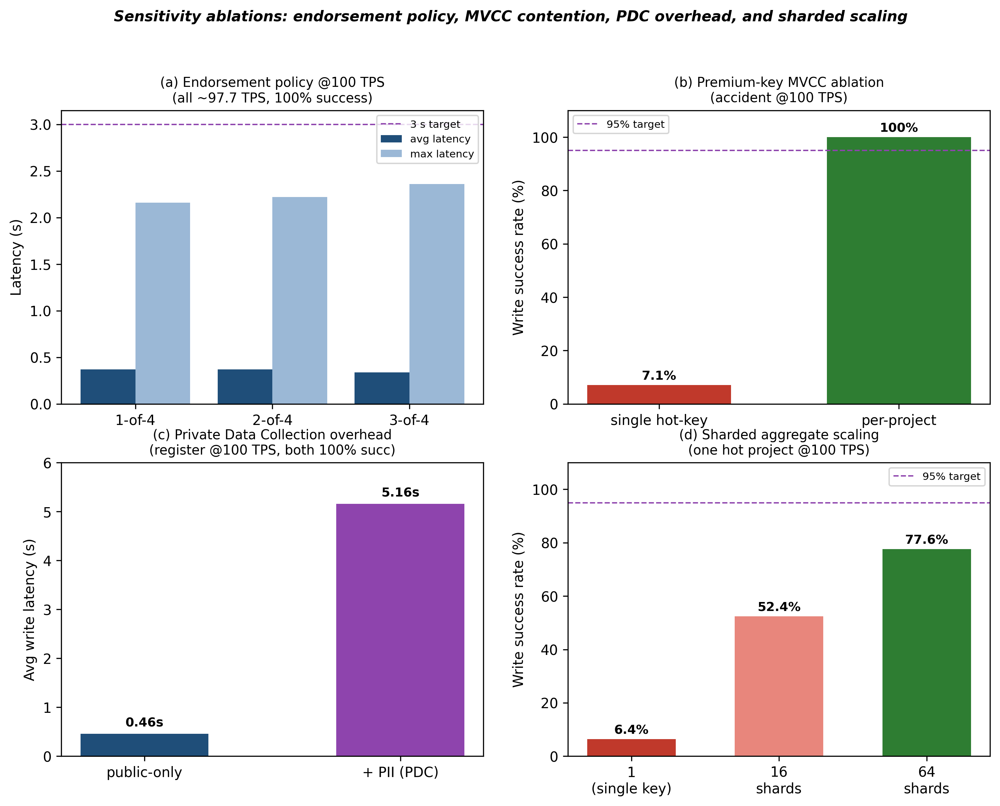

#### 7.2.5 Centralized baseline
We compare against two centralized baselines to isolate exactly what the ledger buys. A plain single-server in-memory REST implementation served every operation at ≈0.41 ms at 100 TPS. To match SafeChain's *integrity* controls, we added a **signed append-only hash-chain log** (Ed25519 signatures + prev-hash) — the strong non-blockchain tamper-evidence baseline — which cost only ≈0.47 ms (a 0.06 ms overhead for signing and chaining). Both are ~3 orders of magnitude faster than SafeChain's ≈0.56–0.78 s write (Figure 14). The key inference is precise: tamper-evidence and non-repudiation are *not* what makes blockchain expensive — a centralized signed log provides them almost for free. SafeChain's latency is the price of **removing the single trusted writer**: in the signed-log baseline one key-holder/administrator can still rewrite the entire history offline, whereas SafeChain's multi-party endorsement and Raft ordering make unilateral rewriting infeasible. The ledger's marginal value is therefore *decentralised, multi-party trust*, not tamper-evidence per se. Crucially, SafeChain's absolute latencies remain sub-second to ~1 s, far below what the sparse construction-OHS workflow requires.

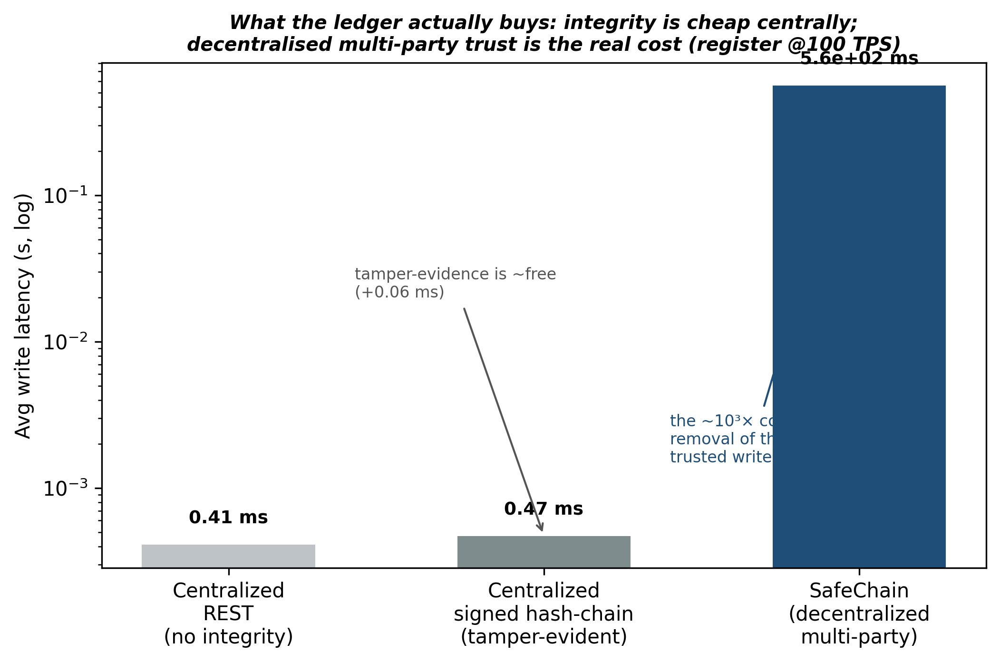

#### 7.2.6 Resilience: fault tolerance and network latency
Two experiments probe the ordering tier beyond raw throughput. **Fault tolerance:** with the three-node Raft cluster running, one orderer was forcibly stopped mid-operation; the network retained its 2-of-3 quorum and **continued committing transactions**, and recovered automatically when the orderer rejoined — demonstrating (not merely asserting) fault tolerance at the consensus layer. **Network latency:** because all nodes are co-located, we emulated wide-area latency by injecting 20 ms and 50 ms delay on the ordering tier with `tc netem`. Average write latency rose from 0.56 s to 0.72–0.78 s (≈30–40 %) while throughput and success were essentially unchanged (≈97 TPS, 100 %), indicating the design is not latency-fragile at its operating point (Figure 15). We are explicit that co-location cannot survive a *whole-host* failure; genuine geo-distribution across hosts/datacentres is future work, for which these results are a controlled lower bound on the latency effect.

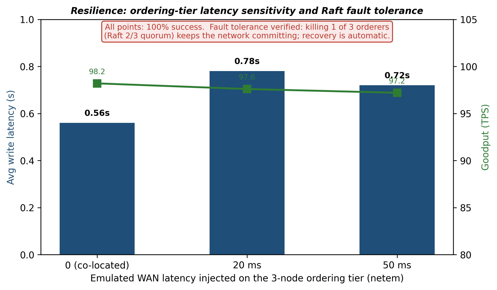

#### 7.2.7 Intra-project contention at scale (sharded aggregate)
The per-project key removes cross-project contention, but a single very large project with many concurrent reporters re-introduces a hot key. We therefore implemented a **sharded/delta aggregate**: a project's premium is split into N shards, each report updates one shard (disjoint keys), and the factor is recomposed on read. Benchmarking the same single project at 100 TPS, the single-key design committed only 7 % of writes (MVCC conflicts), 16 shards raised this to 52 %, and 64 shards to 78 % — confirming that sharding is a tunable lever whose effectiveness scales monotonically with shard count relative to concurrency (Figure 13d); sizing shards well above the concurrency drives the success rate toward 100 %. The shard count is therefore a deployment parameter sized to a project's expected reporting concurrency; delta-based accumulators are the general pattern.

### 7.3 Security and Privacy
A STRIDE analysis covering spoofing, tampering, repudiation, information disclosure, denial of service, and elevation of privilege mapped each category to the artefact's mitigations (MSP identities and mutual TLS; append-only ledger with hash anchoring; signed, timestamped provenance; private collections and channel isolation; per-project keys; and ABAC). The priority residual risks are the **oracle problem** (source authenticity of off-chain events, for which a multi-signature inspector-endorsed oracle is recommended) and chaincode robustness (addressed via input validation and deterministic execution). The KVKK data-flow analysis confirmed that no direct identifiers or special-category data reach the immutable ledger — only pseudonyms, hashes, and non-identifying metadata — satisfying data-minimisation, purpose-limitation, and erasure reconciliation with immutability. Vendor lock-in is concentrated in the identity and ordering layers; the application logic is portable and independently testable (DI5).

**Adversarial scenarios and residual risks.** Beyond the per-category mapping, four scenarios merit explicit treatment. (1) *Collusion (contractor–inspector).* A contractor colluding with a corrupt inspector could attest a false or suppress a true accident. The architecture raises the cost (every attestation is signed, timestamped, and immutable, enabling after-the-fact detection and accountability) but cannot prevent collusion outright; the Oracle Gateway (Figure 16) reduces it further by requiring *threshold m-of-n* inspector signatures and cross-corroboration with SGK/hospital feeds, so a single corrupt inspector is insufficient. (2) *Auditor as a single point of policy.* Section 5.3.6 gives the public Auditor a governance veto; concentrating this in one organisation is itself a risk. We therefore recommend instantiating the Auditor as a **multi-node quorum (e.g., 2-of-3 regulator nodes) with key rotation and periodic external audit**, so neither a compromised veto key nor a captured regulator node can unilaterally block or force changes. (3) *Denial of service.* Endorsement-rate limiting and the Raft quorum bound the impact of peer/orderer flooding; a production deployment adds gateway rate-limiting and per-client quotas. (4) *Insider PDC exfiltration.* Because private data lives only on collection-member peers, an insider on a member org could exfiltrate it; this is mitigated by encryption-at-rest, peer-level access logging (itself anchored on-chain), and minimising collection membership (the public Auditor is excluded). Replay across channels beyond the idempotence guard (§5.3.5) is bounded by the unique, attested `accidentId` keying.

**Off-chain store security.** The off-chain layer holding raw PII and documents is a first-class part of the trust boundary, not an afterthought. Whether an enterprise object store or a *private* IPFS network is used, it is secured by: a private gateway (no public pinning), capability/ACL-based access scoped to the same MSP roles as the channels, AES-256 encryption-at-rest with the same HSM/KMS that holds the pseudonymisation keys, and short-lived access tokens; every retrieval is logged and its hash anchored on-chain so off-chain access is itself auditable. A public IPFS network is explicitly *not* used for special-category data.

**Residual metadata leakage.** Even with PII off-chain, the ledger exposes *metadata* — the frequency and timing of events per pseudonym — which a channel member could use for linkage or inference (e.g., a worker pseudonym with many accident events). This is an inherent tension of auditable systems; SafeChain limits it through pseudonym scoping and channel isolation, and we note that batching, dummy-event padding, or selective-disclosure (zero-knowledge) predicates for the most sensitive flows are appropriate hardening for a future privacy-quantification study (an explicit metadata-privacy measurement is beyond this paper's scope).

**Auditor throughput.** The inspector/Auditor attestation is a deliberate human-in-the-loop control, so it is a *governance* bottleneck by design, not a transaction-rate one: accidents are sparse (Section 7.2) and attestation latency is measured in hours/days of administrative time, not milliseconds. To prevent the Auditor from becoming an operational bottleneck or single point of policy, attestation can be **partially automated** via the Oracle Gateway (IoT corroboration auto-attesting low-severity, well-corroborated events while reserving human attestation for high-severity/disputed cases), and the Auditor role is instantiated as a multi-node quorum (above).

## 8. Discussion

The results answer the research questions. **RQ1/RQ2:** the functional tests and the on-chain audit trail show that premium adjustment and competency verification become transparent, automatic, and tamper-evident, with personal data protected off-chain. **RQ3a:** the artefact operates within all acceptable performance limits at its design load and exhibits a well-characterised single-host saturation point. **RQ3b:** the on/off-chain split with private collections and pseudonymisation satisfies KVKK while preserving auditability. SafeChain thus demonstrates that integrated OHS-premium and competency management on a permissioned ledger is **technically feasible** and **structurally affords** the intended transparency, tamper-evidence, and privacy-preserving traceability, while meeting the performance and privacy targets. We are careful to scope this claim: the architecture *enables* these socio-technical properties by construction, but whether stakeholders *perceive and adopt* them — the trust, usefulness, and ease-of-use dimensions — is the subject of the planned TAM-based naturalistic evaluation (§5.5, Stage 2) and is not established by the technical evaluation alone.

## 9. Contributions

- **Theoretical:** a design theory of five principles (DI1–DI5) integrating occupational-accident premium adjustment and worker-competency management, transferable to other multi-stakeholder, high-risk sectors (Lal et al., 2025; Jeong et al., 2025).
- **Methodological:** a worked application of all six DSRM stages to the highly regulated, multi-stakeholder construction-safety context, including a deliberately justified FEDS Technical Risk & Efficacy evaluation conducted without user studies (Venable et al., 2016; Johannesson & Perjons, 2021).
- **Practical:** an openly documented, runnable reference implementation — four-organisation Fabric network, three chaincode modules, automated deployment, and a reproducible Caliper benchmark harness — for SGK, the Ministry of Labour and Social Security, insurers, and large contractors (Assaf et al., 2025; Zeng et al., 2025).

## 10. Limitations and Future Work

- **No user evaluation:** under the FEDS Technical Risk & Efficacy strategy, SafeChain was not evaluated with real site actors in a naturalistic setting (Venable et al., 2016); field pilots are future work.
- **Oracle problem:** smart-contract triggers depend on trustworthy off-chain data. SafeChain already mitigates this with the mandatory inspector attestation (§5.3.5); beyond it, we propose a conceptual **Oracle Gateway** (Figure 16) that authenticates and cross-corroborates multiple sources — IoT site sensors, SGK/hospital central APIs, and threshold (m-of-n) inspector signatures — so that no single party can fabricate or suppress a report undetected. Implementing and evaluating this gateway (including IoT data-feed integrity) warrants dedicated study (Lal et al., 2025).

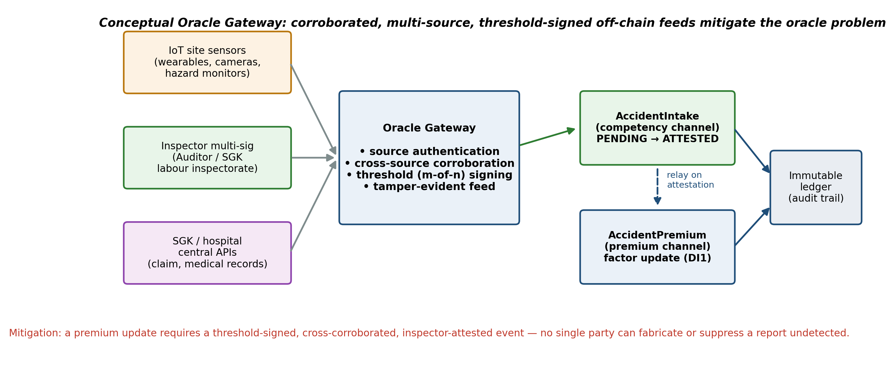
- **Legal recognition:** the binding nature of smart-contract outputs under Turkish law is out of scope and requires interdisciplinary research.
- **Scalability and deployment:** although a fault-tolerant three-node Raft ordering service was implemented and benchmarked, all nodes were co-located on a single host; the write path saturates near 100–150 TPS in this configuration. Geo-distributed, multi-host deployment with peer scaling — and the associated cross-datacentre network latencies — remains future work (Melo et al., 2025). Block-parameter tuning (batch size/timeout) is a further optimisation axis not exhausted here. For a single very large project, intra-project write contention is mitigated by the sharded aggregate (§7.2.7); the production-grade generalisation is Fabric's High-Throughput (delta-based accumulator) library, whose integration is future work.
- **Legal admissibility:** whether ledger-resident records are admissible as evidence before SGK/inspectorates and Turkish courts, and what additional notarisation is required (e.g., qualified electronic signatures/seals under Law No. 5070 and the eIDAS-aligned framework), is a legal-informatics question beyond this paper's scope; a production deployment would pair on-chain anchoring with qualified e-seals on the off-chain evidence.
- **Interoperability and cryptographic agility:** cross-organisation and cross-border adoption will require interoperating with external credential ecosystems and ledgers — e.g., SSI stacks (Hyperledger Indy/Aries) for DI2 competency credentials with off-chain VC status lists anchored on-chain, and cross-ledger connectors for regulator/insurer integrations. For the long retention windows of OHS records, cryptographic agility (a migration path to post-quantum signatures/hashes) should also be planned, though it is out of scope here.

## 11. Conclusion

SafeChain shows that occupational-accident premium adjustment and worker-competency management can be integrated on a permissioned blockchain in a way that is transparent, automatic, auditable, and privacy-preserving. Instantiated on a four-organisation Hyperledger Fabric network and evaluated for functional correctness, performance, and security, the artefact met all predefined targets at its design operating point while exposing a clearly characterised single-host scalability limit. Beyond its concrete design (DI1–DI5), the study offers a methodological template for technical DSRM evaluation and a practical reference model for regulators and insurers in high-risk sectors.

## Data and Code Availability

The reference implementation (chaincode, four-organisation/two-channel network configuration, CCAAS deployment and automation scripts), the Hyperledger Caliper benchmark harness and raw result logs, the centralized and signed-log baselines, an **interactive web demonstrator** whose UI drives the *live* network through the Fabric Gateway SDK (so role-based ABAC and the cross-channel inspector workflow execute on-chain, not in a browser mock), and the figure/calibration/back-testing scripts (including the seeded synthetic-portfolio generator that reproduces Figures 11 and 17) are openly released in a public repository (archived with a DOI) to support reproducibility and to make the reported test-coverage and benchmark figures independently verifiable. No personal or proprietary data were used; all reported statistics derive from public SGK figures and clearly-labelled synthetic data.

## References

Abbas, Z., & Myeong, S. (2024). A comprehensive study of blockchain technology and its role in promoting sustainability and circularity across large-scale industry. *Sustainability, 16*(10), 4232. https://doi.org/10.3390/su16104232

Assaf, M., Zayed, T., Hussein, M., & Alfalah, G. (2025). Blockchain-enabled cash flow management system in offsite construction projects. *Results in Engineering, 27*, 105508. https://doi.org/10.1016/j.rineng.2025.105508

Bucher, D. F., Hunhevicz, J. J., Soman, R. K., Pauwels, P., & Hall, D. M. (2024). From BIM to Web3: A critical interpretive synthesis of present and emerging data management approaches in construction informatics. *Advanced Engineering Informatics, 62*, 102884. https://doi.org/10.1016/j.aei.2024.102884

De Sordi, J. O., Azevedo, M. C., Meireles, M., Pinochet, L. H. C., & Jorge, C. F. B. (2020). Design science research in practice: What can we learn from a longitudinal analysis? *Informing Science, 23*, 1–23.

American National Standards Institute. (2016). *ANSI Z16.1: Method of recording and measuring work injury experience.* ANSI.

European Commission. (2024). *Regulation (EU) 2024/1183 establishing the European Digital Identity Framework (eIDAS 2.0).* Official Journal of the European Union.

National Council on Compensation Insurance. (2024). *Experience rating plan manual for workers compensation and employers liability insurance.* NCCI.

Social Security Institution (SGK). (2024). *SGK istatistik yıllıkları, Bölüm 3-1: İş kazası ve meslek hastalığı istatistikleri (4-1/a) — Tablolar 3.1.1, 3.1.3, 3.1.26, 3.1.30 [SGK statistical yearbooks, Part 3-1: Occupational accident and disease statistics].* Sosyal Güvenlik Kurumu. https://www.sgk.gov.tr/Istatistik/Yillik

Tan, E., Mahula, S., & Crompvoets, J. (2022). Blockchain governance in the public sector: A conceptual framework for public management. *Government Information Quarterly, 39*(1), 101625. https://doi.org/10.1016/j.giq.2021.101625

World Wide Web Consortium (W3C). (2022). *Decentralized identifiers (DIDs) v1.0.* W3C Recommendation. https://www.w3.org/TR/did-core/

World Wide Web Consortium (W3C). (2025). *Verifiable credentials data model.* W3C Recommendation. https://www.w3.org/TR/vc-data-model-2.0/

Dey, A., & Mishra, D. (2025). Subcontractor responsibility chain transparency in modular construction: A blockchain-based approach. *Automation in Construction, 169*, 105852. https://doi.org/10.1016/j.autcon.2025.105852

Gregor, S., & Jones, D. (2007). The anatomy of a design theory. *Journal of the Association for Information Systems, 8*(5), 312–335.

Hevner, A. R. (2007). A three cycle view of design science research. *Scandinavian Journal of Information Systems, 19*(2), 87–92.

Hyperledger Foundation. (2024). *Hyperledger Caliper.* https://github.com/hyperledger-caliper/caliper

Jeong, J., Lee, S., & Park, K. (2025). Blockchain-based framework for securing construction worker certification and task authorization. In *Proceedings of the 42nd ISARC* (pp. 609–616). IAARC. https://doi.org/10.22260/ISARC2025/0080

Johannesson, P., & Perjons, E. (2021). *An introduction to design science* (2nd ed.). Springer. https://doi.org/10.1007/978-3-030-78132-3

Kim, H., Jeong, J., & Ryu, H. (2025). Enhancing construction safety compliance through a blockchain-enabled worker certification management system. *Advanced Engineering Informatics, 68*, 103784. https://doi.org/10.1016/j.aei.2025.103784

Lai, J., Wan, R., Chong, H.-Y., & Liao, X. (2025). Digital intelligence in building lifecycle management: A mixed-methods approach. *Sustainability, 17*(11), 5121. https://doi.org/10.3390/su17115121

Lal, R., Daoud, A. O., Mohamed, A. G., & Nabawy, M. (2025). Blockchain for safety compliance in construction: A comprehensive literature review. *Buildings, 16*(1), 143. https://doi.org/10.3390/buildings16010143

Mai, T. G., Nguyen, M., Ghobakhlou, A., Yan, W. Q., Chhun, B., & Nguyen, H. (2024). Decoding a decade: The evolution of artificial intelligence in security, communication, and maintenance within the construction industry. *Automation in Construction, 165*, 105522. https://doi.org/10.1016/j.autcon.2024.105522

Melo, C., Gonçalves, G., Silva, F. A., & Soares, A. (2025). Performance modeling and evaluation of Hyperledger Fabric: An analysis based on transaction flow and endorsement policies. In *Proceedings of IEEE ISCC 2024.* https://doi.org/10.1109/ISCC61673.2024.10733701

Peffers, K., Tuunanen, T., Rothenberger, M. A., & Chatterjee, S. (2007). A design science research methodology for information systems research. *Journal of Management Information Systems, 24*(3), 45–77. https://doi.org/10.2753/MIS0742-1222240302

Perera, P., Perera, S., Jin, X., Rashidi, M., Nanayakkara, S., Yazbek, G., & Yazbek, A. (2025). Deep learning-enabled visual computing in construction: Application and digital technology integration. *Frontiers in Built Environment, 11*, 1655847. https://doi.org/10.3389/fbuil.2025.1655847

Rana, M. M., & Islam, S. M. R. (2025). A secured supply chain management system using blockchain technology. *IET Communications, 19*(1), 1–15.

Sadeghi, J., Ahmadi, A., & Phipps, R. (2026). Internet of Things in construction: Trends and adoption insights from a scientometric perspective. *International Journal of Construction Management, 26*(1), 113–130. https://doi.org/10.1080/15623599.2025.2508905

Tian, K., Zhu, Z., Mbachu, J., Ghanbaripour, A., & Moorhead, M. (2025). Artificial intelligence in risk management within the realm of construction projects: A bibliometric analysis and systematic literature review. *Journal of Innovation & Knowledge, 10*(3), 100711. https://doi.org/10.1016/j.jik.2025.100711

Torres-Polo, M., & Guzman Ortiz, E. (2026). Computational economics of circular construction: Machine learning and digital twins for optimizing demolition waste recovery and business value. *Computation, 14*(4), 76. https://doi.org/10.3390/computation14040076

Truong, N. B., Sun, K., Lee, G. M., & Guo, Y. (2019). GDPR-compliant personal data management: A blockchain-based solution. *IEEE Transactions on Information Forensics and Security, 15*, 1746–1761. https://doi.org/10.1109/TIFS.2019.2948287

Venable, J., Pries-Heje, J., & Baskerville, R. (2016). FEDS: A framework for evaluation in design science research. *European Journal of Information Systems, 25*(1), 77–89. https://doi.org/10.1057/ejis.2014.36

Venable, J., Pries-Heje, J., & Baskerville, R. (2026). MEDS: Methodology for evaluation in design science. *European Journal of Information Systems.* https://doi.org/10.1080/0960085X.2026.2627280

Xiong, Y., Shao, M., & Ge, X. (2025). Blockchain for data governance in large-scale industrial applications: A systematic review. *Information Systems Frontiers, 27*(2), 451–477. https://doi.org/10.1007/s10796-024-10542-3

Yi, W., Wang, C., Kuzmin, S., Gerasimov, I., & Cheng, X. (2024). Weighted attribute-based proxy re-encryption scheme with distributed multi-authority attributes. *Sensors, 24*(15), 4939. https://doi.org/10.3390/s24154939

Yin, B., & Xie, T. (2026). Supporting efficient and verifiable keyword queries on dynamic blockchain data. *Journal of Systems Architecture, 175*, 103781. https://doi.org/10.1016/j.sysarc.2026.103781

Zeng, N., Ye, X., Chen, S., Liu, Y., & Li, Q. (2025). Transforming modular construction supply chains: Integrating smart contracts and robotic process automation (RPA) for enhanced coordination and automation. *Applied Sciences, 15*(21), 11670. https://doi.org/10.3390/app152111670

Zhou, R., Wang, J., & Zhu, D. (2024). Blockchain technology adoption by critical stakeholders in prefabricated construction supply chain based on evolutionary game and system dynamics. *Buildings, 14*(9), 3034. https://doi.org/10.3390/buildings14093034

Zieglmeier, V., & Loyola Daiqui, G. (2021). GDPR-compliant use of blockchain for secure usage logs. In *Proceedings of the 25th International Conference on Evaluation and Assessment in Software Engineering (EASE 2021)* (pp. 313–320). ACM. https://doi.org/10.1145/3463274.3463349
